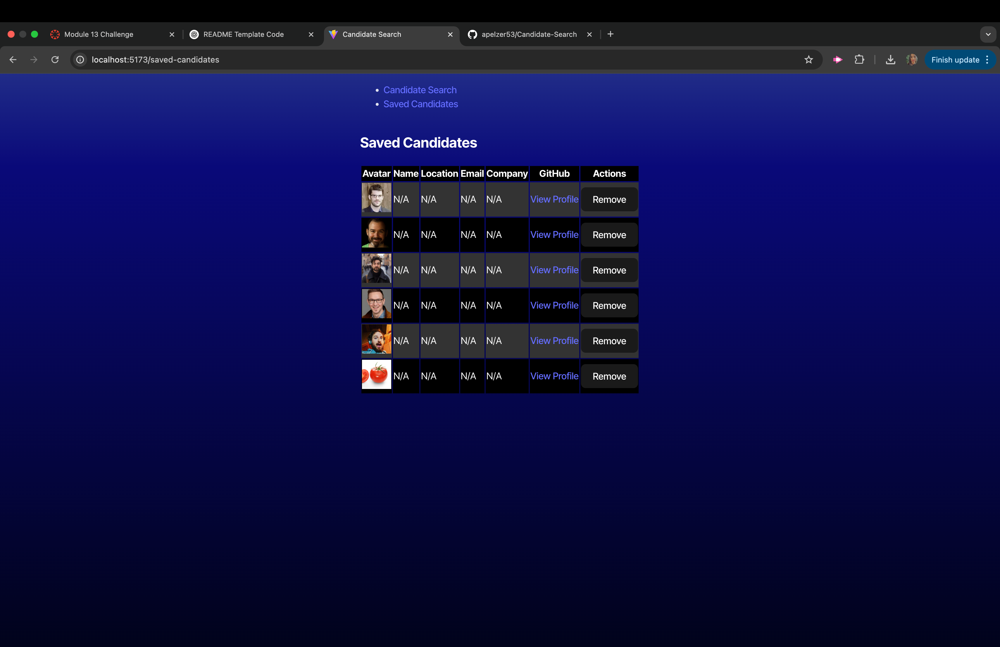
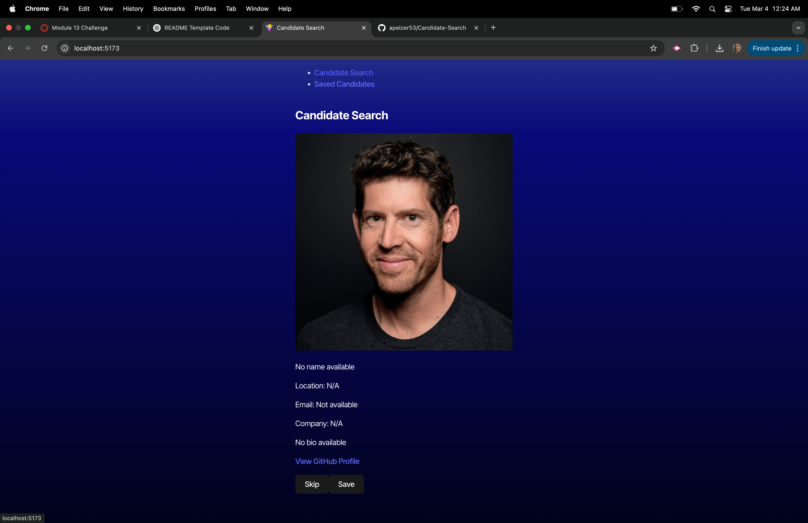

# Candidate Search Application

## Description

This project is a candidate search application that uses the GitHub API to display candidate profiles. It allows users to save or skip candidates, view a list of saved candidates, and persist this data in the browser. The application is built using TypeScript, and it's deployed on Render.

## Technologies Used

- TypeScript
- GitHub API
- Local Storage
- HTML/CSS
- React

## Features

- Displays a list of candidate profiles, including name, username, location, avatar, email, company, and profile URL.
- Allows users to save a candidate to the list or skip to the next candidate.
- Persist the list of saved candidates after page reload.
- Displays a list of saved candidates on a separate page with all the details.
- Message displayed when no more candidates are available.
- Option to view a list of saved candidates, even if none have been accepted.

## Installation

1. Clone the repository:
2. Install the dependencies
3. Create a .env file
4. Run the deployement server

## Usage

1. Open the application in your browser.
2. The application will display a candidate profile.
3. Click the "+" button to save the candidate or the "-" button to skip the candidate.
4. Navigate to the "Saved Candidates" page to view the list of saved candidates.

## Screenshots

## Deployment

The application is deployed on Render.

## Links

https://github.com/apelzer53/Candidate-Search

## Future Enhancements

- Add search functionality to filter candidates by name, location, or company.
- Implement pagination for candidate profiles.
- Improve UI with additional interactivity and responsiveness.

## License

This project is licensed under the MIT License.

---
© 2024 edX Boot Camps LLC. Confidential and Proprietary. All Rights Reserved.